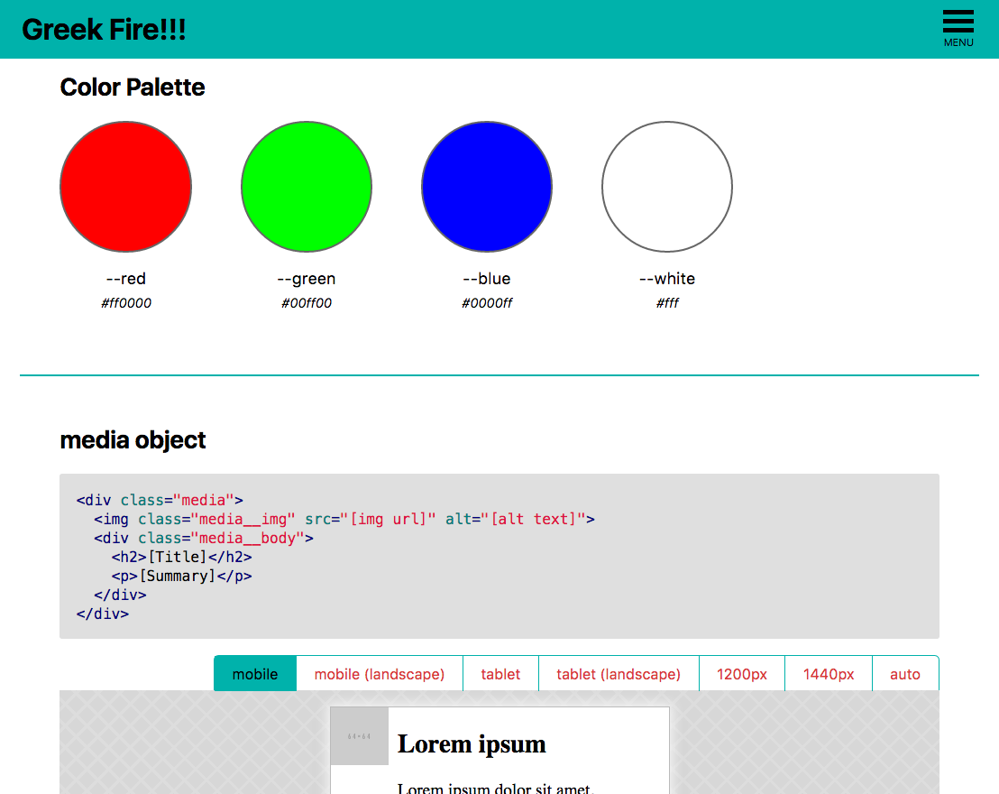

# psg-theme-greek-fire [](https://travis-ci.org/dmarchena/psg-theme-greek-fire)

## Install

`$ npm install psg-theme-greek-fire`


## Usage


### Dinamic device test

If you want to test a component on different resolutions wrap its HTML in a `div` with class `gf-device-test` 

```html
<div class="gf-device-test">
  <!-- Your HTML goes here -->
</div>
```

Then, the theme will include that HTML inside an isolated iframe, which will be accompanied by a toolbar with the following options in order to resize it:

* **mobile**
  - width: 375px
  - height: 667px
* **mobile (landscape)**
  - width: 667px
  - height: 375px
* **tablet**
  - width: 768px
  - height: 1024px
* **tablet (landscape)**
  - width: 1024px
  - height: 768px
* **1200px**
  - width: 1200px
  - height: 514px
* **1440px**
  - width: 1440px
  - height: 617px
* **auto** (default)
  - width: 100%


#### Include additional styles into an iframe

Each iframe will use **only your stylesheet by default**. However, you can add extra styles using the attribute `data-style`:

```html
<div class="gf-device-test" data-style="html, body { padding: 0; margin: 0; background: white }">
  <!-- Your HTML goes here -->
<div>
```

#### Sample CSS comment with device test

    /*
    @styleguide

    @title media object

    The media object is an image to the left, with descriptive content to the right.

    ```
    <div class="media">
      
      <div class="media__body">
        <h2>Lorem ipsum</h2>
        <p>Lorem ipsum dolor sit amet, consectetur adipisicing elit.</p>
      </div>
    </div>
    ```

    <div class="gf-device-test" data-style="html, body { padding: 0; margin: 0; background: white }">
      <div class="media">
        
        <div class="media__body">
          <h2>Lorem ipsum</h2>
          <p>Lorem ipsum dolor sit amet, consectetur adipisicing elit.</p>
        </div>
      </div>
    </div>
    */


## Theme



## License

MIT © 2016 David Marchena
